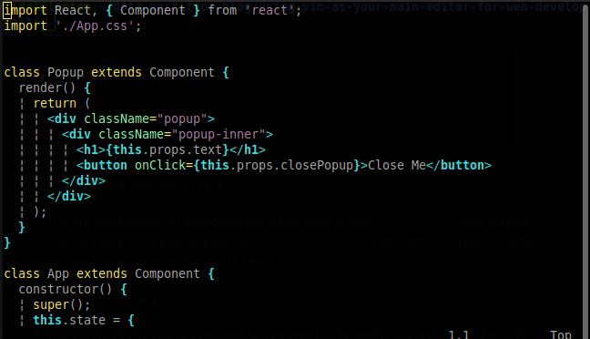

% vim

# Introduction to Vim

Welcome to this introductory lecture on Vim, a powerful and efficient text editor. In this session, we'll cover Vim's basic modes, commands, and some useful plugins. By the end, you should have a foundational understanding of Vim and be able to start customizing it with plugins.


## What is Vim

Vim is a highly efficient, modal text editor designed for both programmers and general text editing. It stands out due to its unique modes: normal, insert, and visual, which streamline navigation, editing, and selection processes. Vim's powerful features include extensive keyboard shortcuts, customization options, and a vast array of plugins. Although it has a steep learning curve, mastering Vim can significantly enhance productivity and speed in coding and text manipulation tasks.


### Why use Vim?

It's a choice. As said before vim has a steep learning curve, but once you master the shortcuts and customize it to your preferences one can see how useful it is to have a completely mouse-free programming experience. Not only that but if you want an entry level experience there are vim emulators implemented in most other modern text editors.

## Basic Navigation and Editing



When programming, you spend most of your time reading/editing, not writing. For this reason, Vim is a modal editor: it has different modes for inserting text vs manipulating text.

Vim is programmable, and Vim’s interface itself is a programming language: keystrokes are commands, and these commands are composable. 

Vim avoids the use of the mouse, because it’s too slow; Vim even avoids using the arrow keys because it requires too much movement.

The end result is an editor that can match the speed at which you think.

For this reason Vim has multiple operating modes:


- **Normal Mode:** For navigation and editing.
- **Insert Mode:** For inserting text.
- **Replace Mode:** For replacing text.
- **Visual Mode:** For selecting text.
- **Command-Line Mode:** For executing commands.

Keystrokes have different meanings in different operating modes. For example, the letter x in Insert mode will just insert a literal character ‘x’, but in Normal mode, it will delete the character under the cursor, and in Visual mode, it will delete the selection.


You change modes by pressing `ESC` (the escape key) to switch from any mode back to Normal mode. 
From Normal mode:

- enter Insert mode with `i`, 
- Replace mode with `R`, 
- Visual mode with `v`, 
- Visual Line mode with `V`,
- Visual Block mode with `<C-v>` (`Ctrl-V`, sometimes also written ^V),
- and Command-line mode with `:`.


1. **Open Vim:**
   ```sh
   vim filename.txt
   ```
 ** Note that if the file doesnt exist vim will create that file

2. **Basic Navigation:**
 - `h` - Move left
 - `j` - Move down
 - `k` - Move up
 - `l` - Move right

3. **Entering and exiting insert mode:**
 - press `i` to enter insert
 - type some text and press `ESC` to return to normal mode

4. **Basic Commands:**
- Save with `:w`
- Quit with `:q`
- Save and quit with `:wq`

5. **Text Manipulation:**
- `dd` - Deletes a whole line
- `x` - Deletes a single character
- `yy` - Copies a line
- `p` - Pastes below the cursor
- `u` - Undoes the last change
- `Ctrl-r` - Redoes last change


### In class exercise (5-10 minutes)
Use Vim to write a code that solves the following problem (Any programming language). No mouse usage only the commands we just learned:

You are given two integer arrays `nums1` and `nums2`, sorted in non-decreasing order, and two integers `m` and `n`, representing the number of elements in `nums1` and `nums2` respectively.

Merge `nums1` and `nums2` into a single array sorted in non-decreasing order and return that array.

Heres some example code in python:

```py
class Solution:
    def merge(self, nums1, m, nums2, n) -> None:
        """
        return a list that contains the merged array
        """


nums1 = [1,2,3]
m = 3
nums2 = [2,5,6]
n = 3

s = Solution()
print(s.merge(nums1, m, nums2, n))

# EXPECTED OUTPUT:
# [1,2,2,3,5,6]
```


## Vim is too basic

Yes, it is. But did i mention it is **highly customizeable**?


Your vim instalation has a global file called `.vimrc`. This file can also be set locally where Vim is being ran so you can have multiple configurations, think of it as multiple python environments.

The `.vimrc` file is a configuration file for Vim, a text editor. It lets you customize Vim’s behavior and appearance to fit your needs.

In it you can set various preferences for example:

1. **Options:**
```sh
set number        " Show line numbers
set tabstop=4     " Set tab width to 4 spaces
set shiftwidth=4  " Use 4 spaces for indentation
```

2. **Commands:**
```sh
autocmd BufWritePre * :%s/\s\+$//e " Remove trailing spaces before saving

```

3. **Plugins** 
- To extend Vim's functionality you can list plugins in there, but where to find these plugins?

### [VimAwesome](https://vimawesome.com/)

VimAwesome is a comprehensive platform dedicated to discovering and exploring plugins for the Vim text editor. It curates a wide range of Vim plugins, categorized by functionality and popularity, providing users with a streamlined way to enhance their Vim setup.

### How to use the plugins?

First you need a plugin manager to easily install and manage plugins. One very popular option is `vim-plug` which you can install with the following command in a terminal window (different instalations for Windows machines)

```sh
curl -fLo ~/.vim/autoload/plug.vim --create-dirs \
  https://raw.githubusercontent.com/junegunn/vim-plug/master/plug.vim
```

Then you can open your `.vimrc` file and add the following lines to the top of your file

```sh
call plug#begin('~/.vim/plugged')

" List plugins here

call plug#end()

```

### Recommended plugins:

1. NerdTree


[NERDTree](https://vimawesome.com/plugin/nerdtree-red) is a popular Vim plugin that provides a file system explorer within Vim. It allows you to navigate your project's directory structure and manage files efficiently from within the editor.

2. FuzzyFinder


The [FuzzyFinder(fzf)](https://vimawesome.com/plugin/fzf) plugin for Vim simplifies locating files and other items by allowing you to search with just a few letters of their names. Instead of needing to type exact file names or paths, you enter a partial string, and the plugin displays a list of matches based on fuzzy matching, which means it looks for items that contain the letters you typed, even if they are not in the exact order. This approach speeds up the process of finding and opening files, making navigation in large projects much more efficient.

3. CVcolorscheme


The `cvcolorscheme` [plugin](https://vimawesome.com/plugin/vim-colorschemes-sweeter-than-fiction) for Vim is designed to enhance the appearance of the Vim editor by providing a collection of visually appealing color schemes. 

With `cvcolorscheme`, users can switch between multiple color schemes effortlessly, tailoring their Vim environment to their personal preferences and improving their overall coding experience. This plugin helps users find a color scheme that suits their style and reduces eye strain during long coding sessions.


## Neovim

An option to those who might fall in love with the vim text editor is using `Neovim` instead.


Neovim is an extensible, modern text editor that builds upon the foundation of Vim, aiming to improve its usability and expand its capabilities. It introduces several enhancements, such as improved support for plugins, better integration with external tools, and a more maintainable codebase. Neovim enhances the Vim experience with features like built-in terminal emulation, asynchronous plugin execution, and a focus on ease of configuration and extensibility. It is designed to provide a more powerful and flexible environment for developers while maintaining compatibility with Vim’s core functionalities and commands.

Most of what was covered in this lecture applies to Neovim as well but there are some upgrades. Notably:

| Feature                    | Vim                                       | Neovim                                      |
|----------------------------|-------------------------------------------|---------------------------------------------|
| **Codebase**               | Legacy codebase, complex to maintain      | Modernized codebase, improved maintainability |
| **Asynchronous Plugins**   | Limited support for asynchronous operations | Built-in support for asynchronous plugins, improving performance |
| **Built-in Terminal**      | No built-in terminal emulator             | Includes a built-in terminal emulator for running shell commands and scripts |
| **Configuration**          | Configuration primarily via `.vimrc`      | Configuration can be done via `init.vim` or `init.lua`, with support for Lua scripting |
| **Extensibility**          | Supports plugins but can be limited in flexibility | Enhanced plugin architecture with more robust API, allowing for more powerful extensions |
| **UI Integration**         | GUI integration often requires external tools | Improved support for external UIs and GUI clients, with a focus on extensibility |
| **Community Contributions**| Established, with a large number of plugins | Active development community, with ongoing improvements and modern features |
| **Performance**            | Generally good, but can be limited by synchronous operations | Optimized for performance with asynchronous processing, reducing lag in plugin operations |
| **Lua Support**            | Limited Lua support, primarily uses Vimscript | Native Lua support for configuration and plugin development, offering more flexibility and performance |
| **Default Behavior**       | Traditional Vim behaviors and defaults    | Includes additional default features and settings for a more modern experience |


## Homework
Using either vim or neovim, install and configure the plugins mentioned here and submit screenshots of vim running in your machine with all 3 plugins operational!

Plugins to be installed:
* NerdTree
* FuzzyFinder
* CVcolorscheme

Where to find them? 
* [VimAwesome](https://vimawesome.com/)
